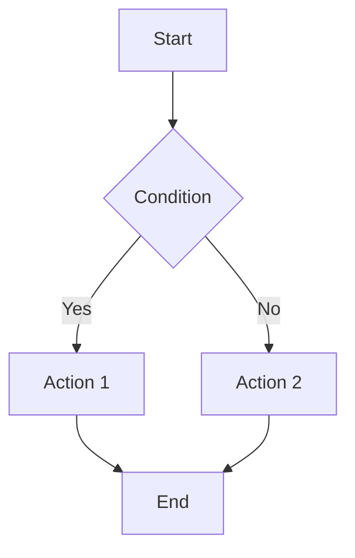
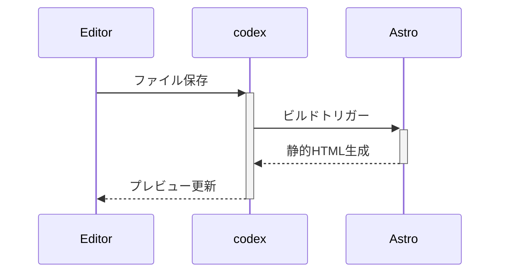

## セットアップ

```bash
# クローン後、依存関係をインストール
npm install

# 開発サーバー起動（http://localhost:4321）
npm run dev

# 本番ビルド（検索インデックスも同時生成）
npm run build

# ビルド結果のプレビュー
npm run preview
```

## ページの作成

新しいページを作成するには、`src/content/wiki/ja/` ディレクトリに `.mdx` ファイルを追加します。

例: `src/content/wiki/ja/my-page.mdx`

```mdx
---
title: ページタイトル
description: ページの説明
tags:
  - タグ1
  - タグ2
date: 2026-06-16
updated: 2026-06-18
---

# 見出し

テキストコンテンツ...
```

ページは自動的に検索インデックスに追加されます。

### フロントマター

| フィールド | 説明 | 必須 |
| --- | --- | --- |
| `title` | ページのタイトル | ○ |
| `description` | ページの説明 | ○ |
| `tags` | タグ | △ |
| `date` | 作成日 | ○ |
| `updated` | 更新日 | △ |
| `draft` | 下書き | △ |
| `hidden` | 非表示 | △ |

## ウィキリンク

```markdown
[[ページタイトル]]　→ ページタイトルでリンク
[[ページタイトル|表示テキスト]] → 表示テキストでリンク
[[ページタイトル#セクション名]] → セクションにリンク
[[サブディレクトリ/ページ名]] → サブディレクトリ内のページでリンク
```

## ディレクトリ構成

コンテンツは`src/content/wiki/[locale]/`配下のリソースとして管理されます。
サブディレクトリでさらに整理することもできます。

```
src/content/wiki/
├── ja/                      → 日本語 (ルート)
│   ├── index.mdx            → /wiki/ja
│   ├── getting-started.mdx  → /wiki/ja/getting-started
│   └── recipes/
│       └── pasta.mdx        → /wiki/ja/recipes/pasta
└── en/                      → 英語
    └── index.mdx            → /wiki/en
```

## サイドバーのカスタマイズ

`src/layout/sidebar.config.ts` を編集してサイドバー構成を変更できます。

```ts
// 手動でリンクを並べる
{
  title: 'ガイド',
  icon: 'fa-solid fa-book',
  items: [
    { slug: 'getting-started', label: 'はじめかた' },
    { slug: 'shortcode-reference', label: 'ショートコード' },
  ],
},

// カテゴリを自動収集
{
  title: 'レシピ',
  icon: 'fa-solid fa-utensils',
  category: 'レシピ',
  autoSort: 'title',
},
```

## GitHub Pages への公開

1. GitHubリポジトリを作成し、コードをpush
2. **Settings → Pages → Source** で `GitHub Actions` を選択
3. サブパス（`/repo-name`）を使う場合は、**Settings → Variables** に以下を設定：
    - `SITE_URL` : `https://usernname.github.io`
    - `BASE_PATH` : `/repo-name`
4. `main` ブランチにpushすると自動デプロイされます。

## 数式

インライン数式: $E = mc^2$

ブロック数式:

$$
\int_{-\infty}^{\infty} e^{-x^2} dx = \sqrt{\pi}
$$

## Mermaid ダイアグラム



