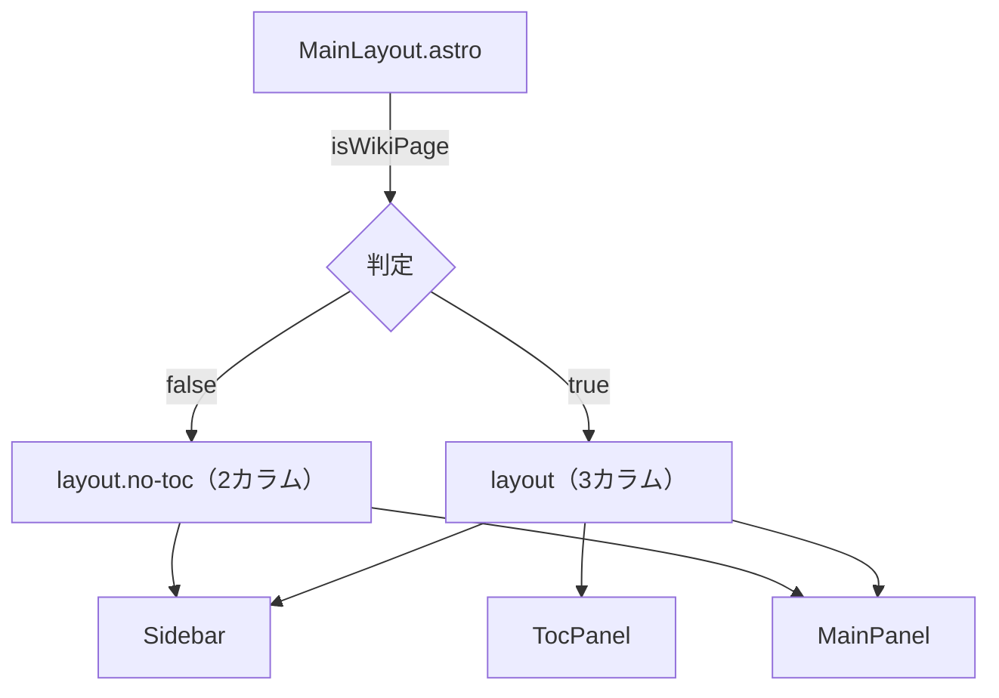

## 概要

snsn-wiki のレイアウトは CSS Grid を使った **3カラム構成**（サイドバー・メイン・TOC）です。
すべてのページは `src/layouts/MainLayout.astro` が提供する1つのレイアウトを共有します。

---

## 全体構造

```
┌────────────────────────────────────────────────┐
│  Header（ヘッダー）               grid: header │
├─────────┬──────────────────────┬───────────────┤
│         │                      │               │
│ Sidebar │   Main Panel         │  TOC Panel    │
│（左欄） │  ┌─────────────────┐ │  （右欄）     │
│         │  │ MainContent     │ │               │
│         │  │  ・page-header  │ │  ・目次       │
│         │  │  ・article      │ │  ・ミニグラフ │
│         │  │  ・tags         │ │               │
│         │  └─────────────────┘ │               │
│         │  Footer              │               │
└─────────┴──────────────────────┴───────────────┘
```

---

## グリッド定義

`global.css` の `.layout` クラスで CSS Grid を定義しています。

| クラス        | grid-template-columns             | grid-template-areas               |
|---------------|-----------------------------------|-----------------------------------|
| `.layout`     | `sidebar-width 1fr toc-width`     | `"header header header" "sidebar main toc"` |
| `.layout.no-toc` | `sidebar-width 1fr`            | `"header header" "sidebar main"`  |

TOCパネルはWikiページ（`isWikiPage=true`）のときのみ表示されます。  
非Wikiページでは `no-toc` クラスが付与されてグリッド列が2本になります。

### CSS変数（`theme.css`）

| 変数                    | デフォルト値 | 説明                           |
|-------------------------|-------------|-------------------------------|
| `--sidebar-width`       | `260px`     | サイドバーの幅                 |
| `--toc-width`           | `220px`     | TOCパネルの幅                  |
| `--header-height`       | `56px`      | ヘッダーの高さ                 |
| `--content-max-width`   | `760px`     | コンテンツの最大幅              |

---

## レスポンシブ対応

| ブレークポイント  | 変化内容                                                     |
|-----------------|-------------------------------------------------------------|
| `≤ 1200px`      | TOCパネルが非表示になり、代わりにフローティングボタンで引き出しを開く |
| `≤ 900px`       | ヘッダーナビゲーションのラベル（テキスト）が非表示になる         |
| `≤ 768px`       | サイドバーが非表示になり、ハンバーガーボタンで開くモーダルになる。ヘッダーのナビリンクも非表示 |
| `≤ 768px`       | グリッドが1カラムに変化（`grid-template-columns: 1fr`）         |

---

## 各エリアの詳細

### Header（ヘッダー）

**ファイル:** `src/components/Header.astro`

- `position: sticky; top: 0;` により常に画面上部に固定
- 左から順に：サイドバーボタン（モバイルのみ表示）→ サイトタイトル → 検索バー → ナビゲーション
- ナビゲーションアイテムは `src/layouts/header.config.ts` で定義

#### 構成要素

```
[☰ button]  [サイトタイトル]  [検索]  [nav links...]  [🌙 テーマ]  [🌐 言語]
```

| 要素                   | クラス / ID           | 説明                                 |
|-----------------------|-----------------------|--------------------------------------|
| サイドバートグルボタン  | `.sidebar-toggle`     | モバイルのみ表示（768px以下）         |
| サイトタイトル          | `.site-title`         | ロケールベースURLへのリンク            |
| 検索コンポーネント      | `HeaderSearch`        | 別コンポーネントとして分離             |
| ナビゲーション          | `.header-nav`         | `header.config.ts` で設定            |
| テーマ切替ボタン        | `#theme-toggle`       | ライト/ダーク切替。`theme.ts` で制御  |
| 言語切替               | `#lang-list`          | `showLanguageSwitcher` が true の場合のみ表示 |

---

### Sidebar（サイドバー）

**ファイル:** `src/components/Sidebar.astro`  
**設定ファイル:** `src/layouts/sidebar.config.ts`

- `position: sticky; top: var(--header-height)` でヘッダー下に貼り付く
- `src/layouts/sidebar.config.ts` でセクション・リンクを設定
- 各セクションは折りたたみ可能（`aria-expanded` + `collapsed` CSS クラス）
- 折りたたみ状態は `localStorage` に保存され、ページ再訪問時に復元される

#### セクション種別

| 種別        | 設定キー      | 挙動                                          |
|-------------|--------------|-----------------------------------------------|
| 手動リンク   | `items`      | 任意のURLやスラッグを直接列挙                  |
| カテゴリ自動 | `category`   | 指定カテゴリ以下の全Wikiページを自動取得・表示  |

- `autoAddUnknownCategories: true` の場合、`sidebarNavigation` で未定義のカテゴリが末尾に自動追加される
- `autoGroupByLeafCategory: true` の場合、パス階層の末尾カテゴリ単位でグループ化される

---

### Main Panel（メインパネル）

**ファイル:** `src/components/MainContent.astro`

- `grid-area: main` に割り当てられたメイン列
- 内部は `flex-direction: column` でコンテンツとフッターを縦積み
- 上部には `MainContent` コンポーネント、下部には `Footer` コンポーネント

#### MainContent 内部構成

```
.main-content
  └── .page-header（showMeta=true のとき）
        ├── .breadcrumb（パンくずリスト）
        ├── h1.page-title（ページタイトル）
        └── .page-meta（カテゴリ・日付）
  └── article.article-content
        ├── <slot />（ページ本文）
        └── .page-tags（タグ一覧）
```

#### パンくずリスト生成ロジック

Wikiページの場合、URLのパスをセグメントに分割してパンくずを自動生成します。

```
/ja/wiki/tech/astro
→ [🏠 Home] / [📁 tech] / [📄 Astroとは]
```

通常ページの場合も同様にURLから生成しますが、中間セグメントはカテゴリページにはリンクされません。

---

### TOC Panel（目次パネル）

**ファイル:** `src/components/Toc.astro`

- Wikiページ（`isWikiPage=true`）のみ表示
- h2・h3・h4 の見出しを一覧表示
- `IntersectionObserver` でスクロール位置に合わせてアクティブ項目をハイライト

#### モバイル時の挙動（≤ 1200px）

1200px 以下ではTOCパネルはグリッドから外れ、画面右端に隠れたパネルになります。  
`#toc-drawer-button`（フローティングボタン）をクリックすると `transform: translateX(0)` でスライドイン表示されます。

---

### Mini Graph（ミニグラフ）

**ファイル:** `src/components/MiniGraph.astro`

- TOCパネル内の下部に表示
- canvas 要素を使い、D3.js でページ間のリンクをグラフ描画
- `data-current-path` 属性経由で現在のページを JavaScript に渡す

---

## レイアウト切り替えフロー



---

## テーマ対応

- `data-theme="dark"` / `data-theme="light"` を `<html>` 要素に付与することでCSSカスタムプロパティが切り替わる
- ページ読み込み時に `localStorage.getItem('theme')` を参照し、未設定の場合は OS の `prefers-color-scheme` を優先する（`MainLayout.astro` の `<script is:inline>`）
- テーマ切替ボタン（`#theme-toggle`）がクリックされると `theme.ts` が `data-theme` を更新して `localStorage` に保存する

---

## 関連ファイル一覧

| ファイル                               | 役割                                      |
|---------------------------------------|------------------------------------------|
| `src/layouts/MainLayout.astro`        | 全体レイアウト・HTML構造・メタタグ        |
| `src/layouts/header.config.ts`        | ヘッダーナビゲーション設定                |
| `src/layouts/sidebar.config.ts`       | サイドバーナビゲーション設定              |
| `src/components/Header.astro`         | ヘッダーコンポーネント                    |
| `src/components/Sidebar.astro`        | サイドバーコンポーネント                  |
| `src/components/MainContent.astro`    | メインコンテンツコンポーネント            |
| `src/components/Toc.astro`            | 目次コンポーネント                        |
| `src/components/MiniGraph.astro`      | ミニグラフコンポーネント                  |
| `src/components/Footer.astro`         | フッターコンポーネント                    |
| `src/styles/global.css`               | グローバルスタイル（レイアウト含む）      |
| `src/styles/theme.css`                | CSS カスタムプロパティ（ライト/ダーク）   |
| `src/scripts/main.ts`                 | メインスクリプト（各機能の初期化）        |
| `src/scripts/sidebar.ts`              | サイドバー開閉ロジック                    |
| `src/scripts/toc.ts`                  | TOCスクロール追従・ドロワー制御           |
| `src/scripts/theme.ts`                | テーマ切替ロジック                        |
